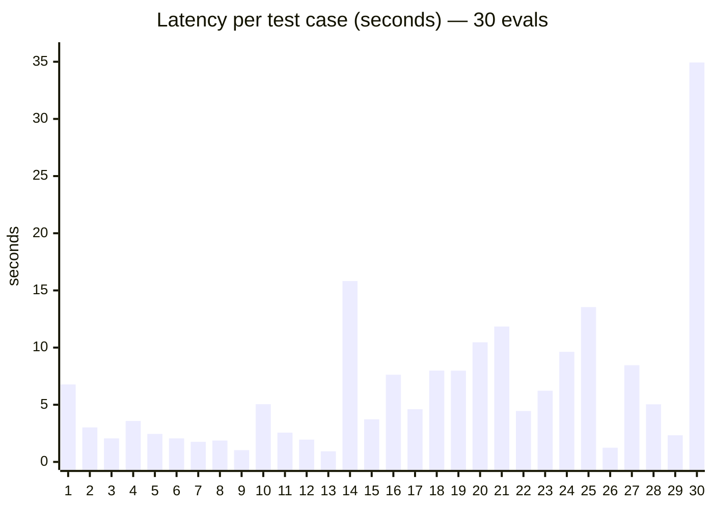
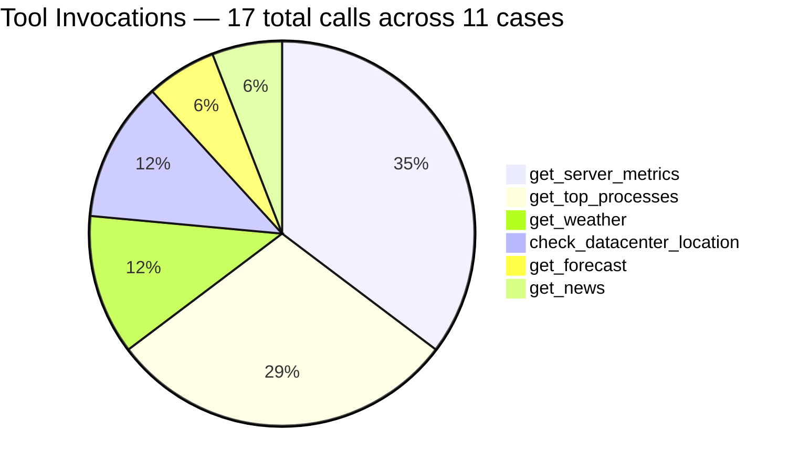
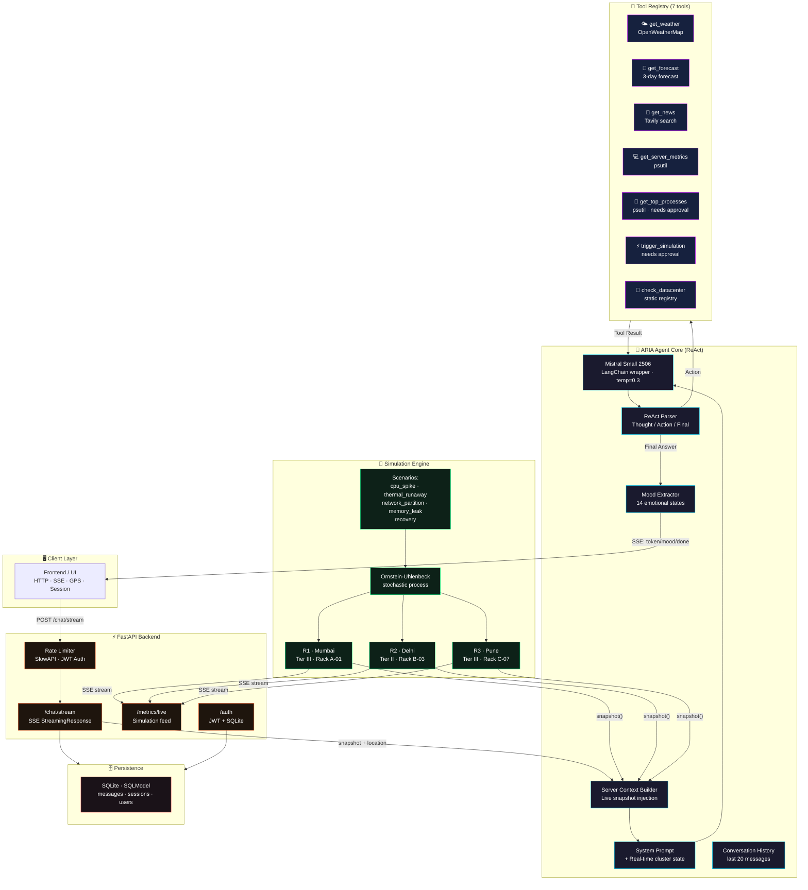
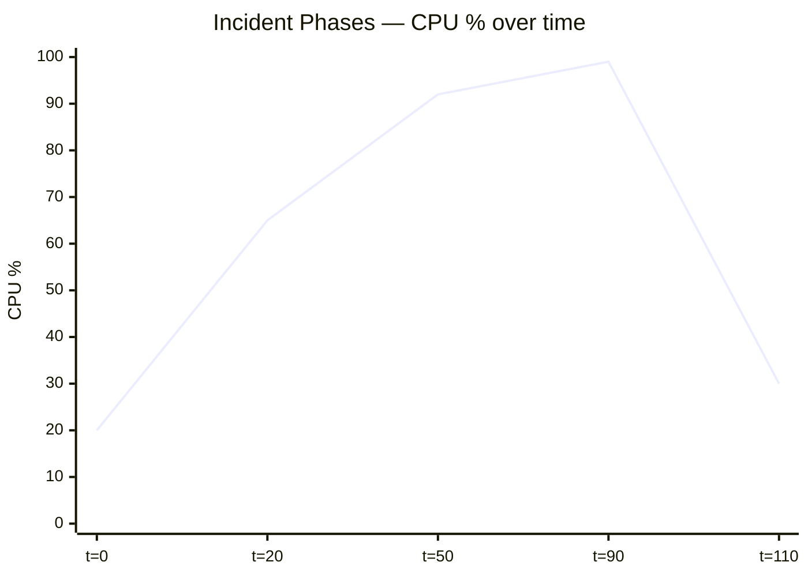
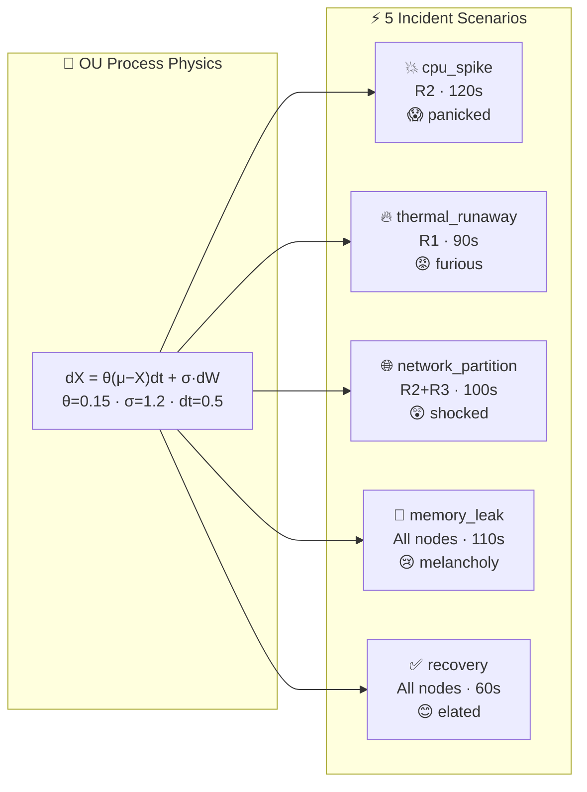
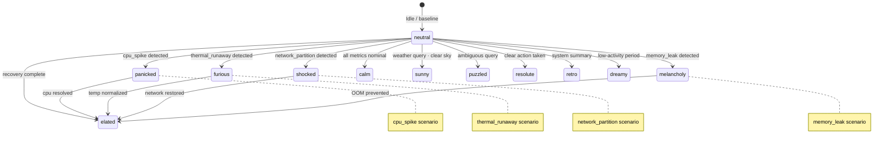
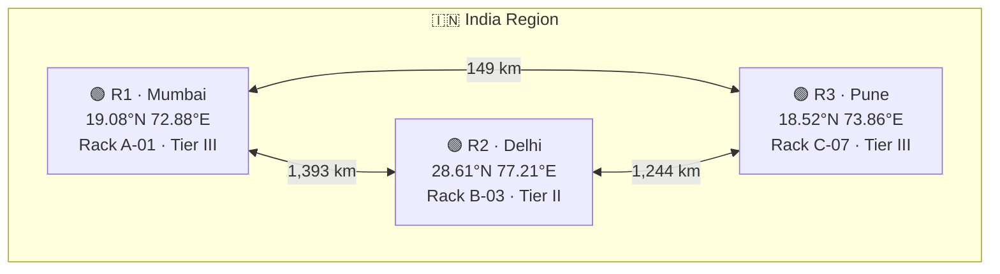

<div align="center">


<br/>

<a href="https://aria-smart-server-management-system.vercel.app"></a>
<a href="#"></a>
<a href="#"></a>
<a href="#"></a>
<a href="#"></a>
<a href="#"></a>

<br/><br/>

<a href="https://aria-smart-server-management-system.vercel.app"></a>
<a href="https://ragas111-aria-server-management-backend.hf.space"></a>
<a href="https://ragas111-aria-server-management-backend.hf.space/docs"></a>
<a href="https://ragas111-aria-server-management-backend.hf.space/health"></a>

<br/><br/>

> **Monitors · Reasons · Acts · Streams**
>
> ReAct loop · Mistral AI · FastAPI · SSE · Live Incidents · Mood Detection
> 3 nodes · India region · R1 Mumbai · R2 Delhi · R3 Pune

</div>

---

## ⚡ What is ARIA?

**ARIA** (Autonomous Realtime Intelligence Agent) is an AI-powered ops agent that monitors a live server room of **3 nodes** across India, reasons with a **ReAct loop**, streams responses word-by-word via **Server-Sent Events**, detects emotional **mood states** per reply, and simulates realistic incidents using an **Ornstein-Uhlenbeck stochastic process**. Every single agent response includes the current live cluster snapshot — ARIA always knows the real-time situation without burning tool calls on it.

---

## 🌐 Live Deployment

| Service | URL | Status |
|---------|-----|--------|
| ▲ **Frontend** | [aria-smart-server-management-system.vercel.app](https://aria-smart-server-management-system.vercel.app) |  |
| 🤗 **Backend API** | [ragas111-aria-server-management-backend.hf.space](https://ragas111-aria-server-management-backend.hf.space) |  |
| 📖 **API Docs** | [.hf.space/docs](https://ragas111-aria-server-management-backend.hf.space/docs) |  |
| 💓 **Health** | [.hf.space/health](https://ragas111-aria-server-management-backend.hf.space/health) |  |

---

## 📊 Evaluation Metrics

<div align="center">

| 🎯 Pass Rate | ✨ Avg Score | ⚡ Avg Latency | 🧠 Context-Only |
|:-----------:|:-----------:|:-------------:|:--------------:|
| **96.7%** | **0.997 / 1.000** | **6.37s** | **63.3%** |
| 29 / 30 cases | near-perfect | min 0.93s · max 34.9s | zero tool calls needed |

</div>

### 📈 Per-Case Latency Distribution



> **Case 14** (15.82s) and **Case 30** (34.94s) are multi-tool chains. **Case 20** is the only failure (score=0.9, missing `Delhi` keyword). **63.3%** of cases answered from live context alone — no tools invoked.

### 🔧 Tool Usage Breakdown



---

## 🏗️ Architecture



---

## 🔄 ReAct Agent Loop

```mermaid
flowchart LR
    A([👤 User Query]) --> B

    subgraph CTX["Context Injection"]
        B["Fetch live snapshot\nfrom SimEngine"]
        C["Build server context\n+ datacenter geo\n+ operator GPS"]
        B --> C
    end

    C --> D["Prepend to\nSystem Prompt"]
    D --> E(["🧠 Mistral LLM\ncall"])

    E --> F{Parse\nReAct output}

    F -->|"Thought + Action"| G["Emit thought\nSSE event"]
    G --> H{Tool\nneeds\napproval?}
    H -->|Yes| I["⏸ Pause —\nWait for\nhuman approval"]
    I -->|Approved| J["🔧 Execute Tool"]
    I -->|Denied| K["Skip tool\ncontinue"]
    H -->|No| J
    J --> L["Emit tool_use\n+ tool_result SSE"]
    L --> M{Loop guard\nsame tool ≥ 3×?}
    M -->|Yes| N["Force synthesis\nprompt → Final"]
    M -->|No| E

    F -->|"Final Answer"| O["Stream answer\nword-by-word SSE"]
    K --> E
    N --> O
    O --> P["Extract mood\n14 states"]
    P --> Q["Emit done SSE\n+ save to DB"]
    Q --> R([✅ Response complete])

    F -->|"MAX_ITER=6\nexhausted"| N

    style A fill:#1a2e1a,stroke:#00ff88
    style R fill:#1a2e1a,stroke:#00ff88
    style E fill:#1a1a2e,stroke:#00d4ff
    style I fill:#2e1a0d,stroke:#ff6b35
    style N fill:#2e0d0d,stroke:#ff4757
```



---

## 🎭 Simulation Engine — Incident Scenarios





| Scenario | Affected | Duration | Peak Metric | Mood |
|----------|---------|---------|-------------|------|
| `cpu_spike` | R2 | 120s | CPU 99% | 😱 panicked |
| `thermal_runaway` | R1 | 90s | Temp 88°C | 😡 furious |
| `network_partition` | R2, R3 | 100s | Net 5 Mbps | 😲 shocked |
| `memory_leak` | All | 110s | RAM 95% | 😢 melancholy |
| `recovery` | All | 60s | — | 😊 elated |

---

## 🎭 Mood State Machine

ARIA detects an emotional **mood per response** — 14 possible states — biased by active incidents:



---

## 🛠️ Tech Stack

<div align="center">

| Layer | Technology | Purpose |
|-------|-----------|---------|
| **LLM** | Mistral Small 2506 | ReAct reasoning · temp=0.3 |
| **Agent Framework** | LangChain | Tool binding · message types |
| **API** | FastAPI | Async · SSE · rate limiting |
| **Streaming** | Server-Sent Events | Word-by-word token stream |
| **Simulation** | Ornstein-Uhlenbeck | Realistic metric physics |
| **DB** | SQLite + SQLModel | Session · message · user |
| **Auth** | JWT | Bearer token auth |
| **Weather** | OpenWeatherMap | Live weather at node cities |
| **News** | Tavily | Real-time news search |
| **Metrics** | psutil | Host CPU · RAM · disk · net |
| **Container** | Docker | Single-container deploy |
| **Rate Limit** | SlowAPI | Per-IP throttling |
| **Frontend** | Vercel | React UI · SSE consumer |
| **Backend Host** | Hugging Face Spaces | FastAPI deployment |

</div>

---

## 📁 Project Structure

```
aria/
├── frontend/                         # → Vercel deployment
│   └── ...                           # React UI · SSE consumer · GPS
│
├── backend/                          # → Hugging Face Spaces
│   ├── core/
│   │   ├── agent.py          # ReAct loop · streaming · mood · history
│   │   └── config.py         # Pydantic settings · env vars
│   ├── routers/
│   │   ├── chat.py           # /chat/stream · /chat/approve · /chat/history
│   │   ├── metrics.py        # /metrics/live SSE feed
│   │   └── auth.py           # /auth/register · /auth/login
│   ├── simulations/
│   │   └── engine.py         # OU process · 5 scenarios · snapshot()
│   ├── tools/
│   │   └── all_tools.py      # 7 LangChain tools · approval registry
│   ├── models/
│   │   ├── user.py           # User SQLModel
│   │   └── db.py             # SQLite engine · session · Message model
│   ├── tests/
│   │   ├── test_api.py       # API integration tests
│   │   ├── test_aria_quality.py  # Quality eval harness
│   │   ├── test_deep.py      # Deep scenario tests
│   │   └── aria_eval_results.json  # 30-case eval · 96.7% pass
│   ├── main.py               # FastAPI app · lifespan · CORS · routes
│   ├── requirements.txt
│   ├── Dockerfile
│   └── .env.example
└── .gitignore
```

---

## 🚀 Quick Start

> **No setup needed** — live stack already deployed:
> - Frontend → [aria-smart-server-management-system.vercel.app](https://aria-smart-server-management-system.vercel.app)
> - API → [ragas111-aria-server-management-backend.hf.space](https://ragas111-aria-server-management-backend.hf.space)

### Run locally

#### 1 · Clone & configure

```bash
git clone https://github.com/YOUR_USERNAME/aria.git
cd aria/backend
cp .env.example .env
```

Edit `.env`:

```env
MISTRAL_API_KEY=your_mistral_key
OPENWEATHER_API_KEY=your_owm_key      # optional — weather tools
TAVILY_API_KEY=your_tavily_key        # optional — news tool
SECRET_KEY=your_jwt_secret
CORS_ORIGINS=http://localhost:3000
```

#### 2 · Run backend

```bash
pip install -r requirements.txt
uvicorn main:app --reload --port 8000
```

#### 3 · Docker

```bash
docker build -t aria .
docker run -p 8000:8000 --env-file .env aria
```

#### 4 · Chat with ARIA

```bash
# Against live API
curl -N -X POST https://ragas111-aria-server-management-backend.hf.space/chat/stream \
  -H "Content-Type: application/json" \
  -d '{"message": "What is the current server status?", "session_id": "demo"}'

# Or local
curl -N -X POST http://localhost:8000/chat/stream \
  -H "Content-Type: application/json" \
  -d '{"message": "Trigger a cpu_spike on R2", "session_id": "demo"}'
```

---

## 📡 API Reference

| Method | Endpoint | Description |
|--------|----------|-------------|
| `POST` | `/chat/stream` | Stream agent response (SSE) |
| `POST` | `/chat/approve` | Approve/deny tool call |
| `GET`  | `/chat/history/{session_id}` | Fetch message history |
| `GET`  | `/chat/context` | Preview live ARIA context |
| `GET`  | `/metrics/live` | SSE stream of node metrics |
| `POST` | `/auth/register` | Create account |
| `POST` | `/auth/login` | Get JWT token |
| `GET`  | `/health` | Liveness check |

### SSE Event Types

```
event: thought      → ARIA's internal reasoning step
event: tool_use     → tool name + args being invoked
event: tool_result  → tool output (truncated at 800 chars)
event: token        → answer chunk (5 words at a time)
event: mood         → { mood: "panicked", reason: "..." }
event: done         → final full text + session_id + mood
event: error        → error message
```

---

## 🗺️ Datacenter Registry



Operator GPS is injected at runtime — ARIA computes haversine distance to each node and marks the nearest datacenter in every response.

---

## 🔑 Key Design Decisions

**Context injection over tool calls** — Every request embeds the live cluster snapshot directly into the system prompt. ARIA answers 63% of queries without any tool call, saving latency and API cost.

**Loop guard** — If the same tool is called 3+ times in one turn, ARIA is forced into a synthesis prompt to avoid infinite loops (a real problem with ReAct agents).

**Approval gates** — `trigger_simulation` and `get_top_processes` require explicit human approval before execution, preventing runaway automated actions on live infrastructure.

**Ornstein-Uhlenbeck physics** — Metrics don't random-walk; they drift toward scenario targets with noise, producing realistic smooth curves that mimic real server telemetry.

**Mood biasing** — Active incidents override the LLM's mood inference with the scenario's predefined mood, ensuring ARIA's emotional state always matches the ops situation.

---

<div align="center">


**Built with** `FastAPI` · `Mistral AI` · `LangChain` · `Server-Sent Events` · `SQLite` · `Docker` · `Python 3.11+`

</div>
